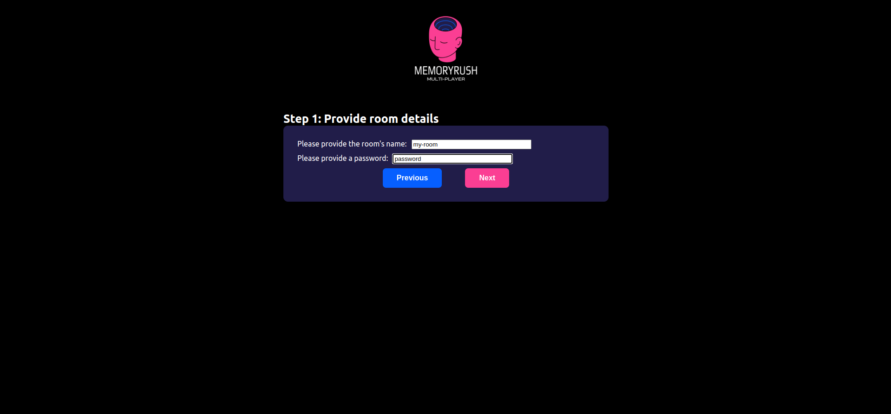
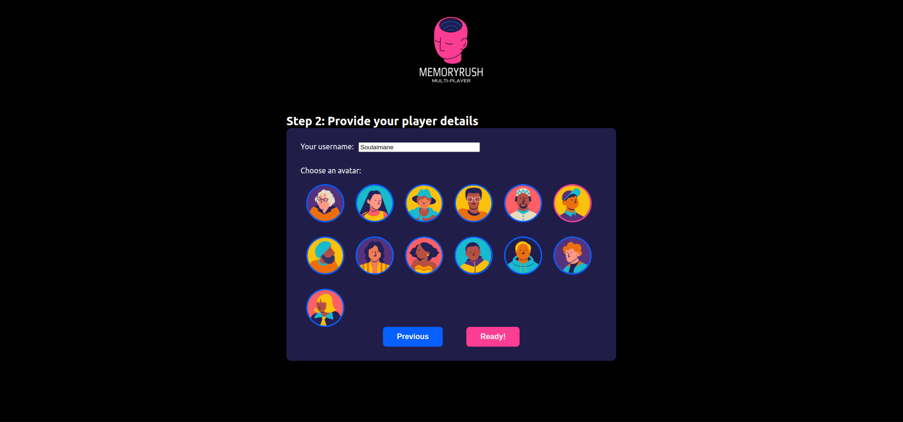
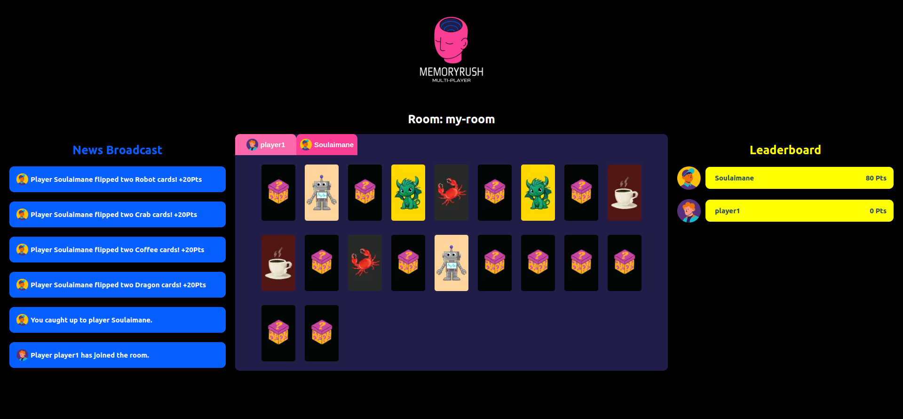

<div style="text-align:center;">
  <br>
  <h1>MemoryRush (Multiplayer Memory Card Game)</h1>
</div>


This project was built to showcase the power of real-time communication using WebSockets. Unlike traditional HTTP requests that require constant refreshing, WebSockets allow for instant, two-way interaction between the client and the server. The goal of this game is not just to entertain, but to demonstrate how modern web applications can provide a smooth, dynamic user experience with live updates. The backend is powered by Python(Django), while the frontend is built with React.js, all working together to create a fast and responsive game environment.

## Game Overview
A multiplayer memory card game where players:
- Join rooms using a room name and password.
- Customize their profile with username and avatar.
- Compete to match pairs from 20 cards.
- Win by being the first to finding all of the matching pairs.

## Features
- Real-time gameplay using WebSockets.
- Secure room system with password protection.
- Player customization with avatars.
- Live game state updates.
- Multi-player support.

## Tech Stack
- Backend: Python/Django + Django Channels.
- Frontend: React.js.
- WebSocket Protocol for real-time communication.
- Redis for temporary game state storage.


## Prerequisites
Ensure you have the following installed on your system:
- Docker.
- Docker Compose.

## Using the `docker-compose` File
To start the application using `docker-compose`, follow these steps:
1. Clone the repository:
    ```bash
    git clone https://github.com/elmaniouiSoulaimane/memoryrush.git
    cd memoryrush
    ```

2. Run the docker compose command:
    ```bash
    docker compose up
    ```
    This command will:
    - Build the necessary Docker images (if not already built).
    - Start the services defined in the docker-compose.yml file.

3. Access the application:
    - head to `http://localhost:8080/`


## Screenshots
### Step 1: Create a room


### Step 2: enter a username and select an avatar


### The Room

- Each player can play while getting live notifications about other players activity, or he can checkout other players board by switching to the players tab